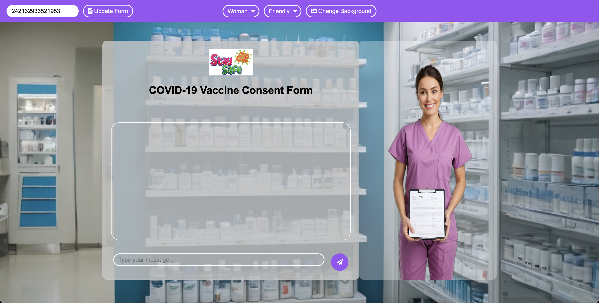

Code of the web app I made for Jotform internship demo. Enjoy :)

# UI

# How to Run

You will need an endpoint URL to be able to send an HTTP request to generate the images.

This URL will be used as follows: `URL + /sdapi/v1/txt2img`

So the endpoint will come from [Auto's SD webui Docker container](https://github.com/afurkank/img-gen-webui?tab=readme-ov-file#how-to-run).

You can specify this URL as an environment variable inside your .env file with the name *"IMG_GEN_ENDPOINT_URL"*